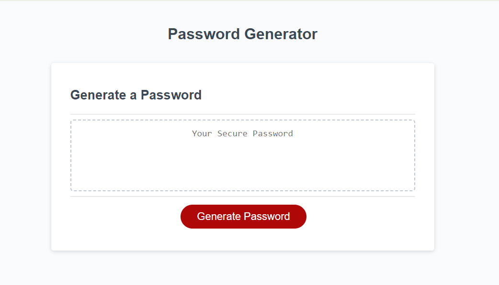

# Javascript Random Password Generator

## Description
This application updated JavaScript provided in challenge, with HTML and CSS files to get a password generator fully functioning by meeting alpha-numeric-symoblic criteria in order to create a strong password, providing greater security.  The character count of equal to or greater than 8 and equal to or less than 128 was also implemented.  The prompts were configured to confirm whether or not the character types would include (or not) lowercase letters, capital letters, numbers and special characters.

## Screenshot

## Link to video

## Table of Contents
- [Description](#description)
- [Screenshot](#screenshot)
- [Link to video](#link-to-video)
- [Usage](#usage)
- [Licence](#license)
- [Contributing](#contributing)
- [Credits](#credits)
- [Questions](#questions)

## Usage
Access the password generator by opening the provided URL in your browser. Click the "Generate Password" button and follow the prompts to create a random password.

## License
 
  This project is licensed under the MIT license.  

## Contributing
For contributions, please contact me directly.

## Credits
Starter code: [friendly-parakeet](https://github.com/coding-boot-camp/friendly-parakeet)

## Questions
If you have any questions I may or comments, be contacted at [GitHub](https://github.com/cdepalma32) or by [email](mailto:crystaldepalma@yahoo.com).

